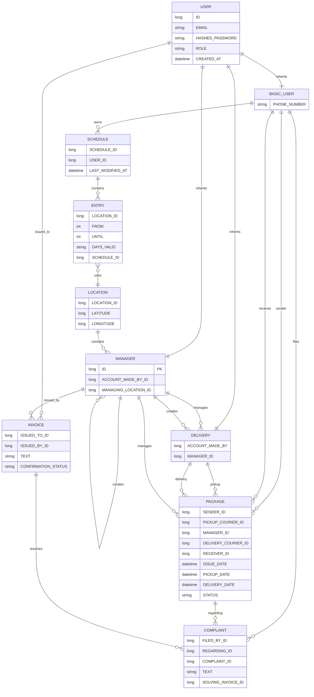

# DynamicDeliverySystem
## Hiii 👋 - this is a work in progress project! I'm glad that you decided to visit it!

It's meant to be a system that supports a delivery service where the user can define their schedule and have the parcel be delivered at their actual location. 📦🗓️🧭📍🔄 

### Ever had to leave work early just to catch a parcel that's supposed to arrive at your home?

Basically, for each day of the week, the user can **define the time periods and the locations** where they're found at.

Using this schedule (*without needing to know ahead of time*), the courier can now do their job, at the **right place and at the right time ** - not just "Leave it at the entrance" or "It's been placed in an easybox where you can pick it up".

## Quick start (Docker)

**Prerequisites:** Docker 24+, Docker Compose v2

```bash
docker compose up --build
```

Open **http://localhost** once all services are healthy.

### Seed manager account

On first startup, a root manager is created automatically:

| Field | Value |
|-------|-------|
| Email | `manager@delivery.local` |
| Password | `Manager123!` |

### Typical demo flow

1. Register two **basic** users (sender and recipient).
2. As sender: open **My account (schedule)**, add map locations, and save.
3. As sender: **Place an order** with the recipient's email and a pickup date (today or later).
4. Log in as the seed manager and create a **delivery** courier account.
5. Assign the pending package to the courier for pickup, then delivery.
6. As courier: confirm pickup and deposit under **Review Current Assignments**.
7. As manager: assign the package for final delivery once it is in storage.
8. As courier: use **Finish delivery** to get the confirmation code.
9. As recipient: **Confirm Delivery** with that code.

### Local development (without Docker)

**Backend:** Java 21, Maven 3.9+, MySQL 8

```bash
cd frontend && npm ci && npm run build
cd ../backend && mvn package
java -jar target/*.jar
```

**Frontend dev server** (proxies `/api` to port 8080):

```bash
cd frontend && npm run dev
```

Copy `.env.example` to `.env` and adjust `DB_*` / `JWT_SECRET` as needed.

If the backend fails on startup with a `phone_number` constraint error after upgrading, reset the database volume:

```bash
docker compose down -v
docker compose up --build
```

## Use case diagram


## ER diagram




## Regarding Security...

Exposing your entire schedule might seem risky. It's true!

Here's how information leak issues are avoided:

1. Couriers are never aware about whom the package is 
delivered to. All they see is a phone number,
some coordinates and the available time window.

2. On delivery, identity is confirmed by a
common confirmation code.

3. When someone desires to send a package,
all they need is an email - no other personal details
to be specified.

4. Managers can't view the schedules of clients at all.

Unless attacked, this system is safer by design
than the standard delivery apps.