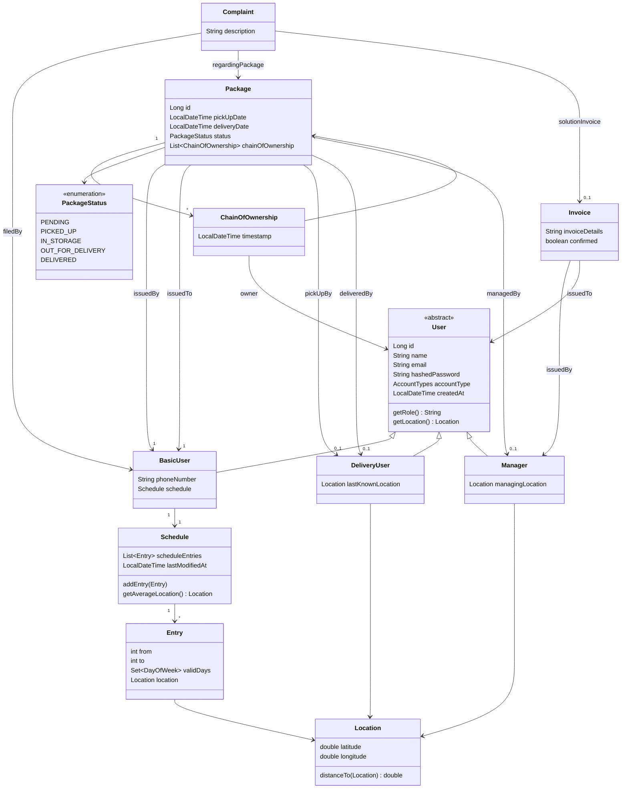

# DynamicDeliverySystem

It's meant to be a system that enables a delivery service where the user can define their schedule and have the parcel be delivered at their actual location. 📦🗓️🧭📍🔄 

### Ever had to leave work early just to catch a parcel that's supposed to arrive at your home?

Basically, for each day of the week, the user can **define the time periods and the locations** where they're found at.

Using this schedule the system provides couriers with the customer's expected location during the scheduled delivery window, reducing failed delivery attempts, not just "Leave it at the entrance" or "It's been placed in an easybox where you can pick it up".

## How does it look?

Client view :

[BasicUser.webm](https://github.com/user-attachments/assets/0970f919-1ee5-42de-92ab-7740ad6bfe72)

Delivery person view :

[Delivery.webm](https://github.com/user-attachments/assets/9a82fb6e-c05e-4cab-a2b2-856451dcc265)

Manager person view : 

[Manager.webm](https://github.com/user-attachments/assets/d3847efc-b099-4a0b-b72c-4a3a0059dd21)


## Quick start (Docker)

**Prerequisites:** Docker 24+, Docker Compose v2

```bash
docker compose up --build
```

Open **http://localhost** once all services are healthy.

### Seed manager account

On first startup, a root manager is created automatically:

| Field | Value |
|-------|-------|
| Email | `manager@delivery.local` |
| Password | `Manager123!` |

### Typical demo flow

1. Register two **basic** users (sender and recipient).
2. As sender: open **My account (schedule)**, add map locations, and save.
3. As sender: **Place an order** with the recipient's email and a pickup date (today or later).
4. Log in as the seed manager and create a **delivery** courier account.
5. Assign the pending package to the courier for pickup, then delivery.
6. As courier: confirm pickup and deposit under **Review Current Assignments**.
7. As manager: assign the package for final delivery once it is in storage.
8. As courier: use **Finish delivery** to get the confirmation code.
9. As recipient: **Confirm Delivery** with that code.

### Local development (without Docker)

**Backend:** Java 21, Maven 3.9+, MySQL 8

```bash
cd frontend && npm ci && npm run build
cd ../backend && mvn package
java -jar target/*.jar
```

**Frontend dev server** (proxies `/api` to port 8080):

```bash
cd frontend && npm run dev
```

Copy `.env.example` to `.env` and adjust `DB_*` / `JWT_SECRET` as needed.

```bash
docker compose down -v
docker compose up --build
```

## Use case diagram


## ER diagram




## Regarding Security...

Exposing your entire schedule might seem risky. It's true!

Here's how the system reduces information leakage:

1. Couriers are never aware about whom the package is 
delivered to. All they see is a phone number,
some coordinates and the available time window.

2. On delivery, identity is confirmed by a
common confirmation code.

3. When someone desires to send a package,
all they need is an email - no other personal details
to be specified.

4. Managers can't view the schedules of clients at all.

5. All API endpoints require JWT authentication and authorization.

The system reduces the amount of personal information exposed to delivery personnel compared to traditional delivery workflows.

## Tech Stack

Backend
- Java 21
- Spring Boot
- Spring Security
- JWT Authentication
- MySQL
- Maven

Frontend
- React
- TypeScript
- React Leaflet

Infrastructure
- Docker
- Docker Compose
- Nginx
