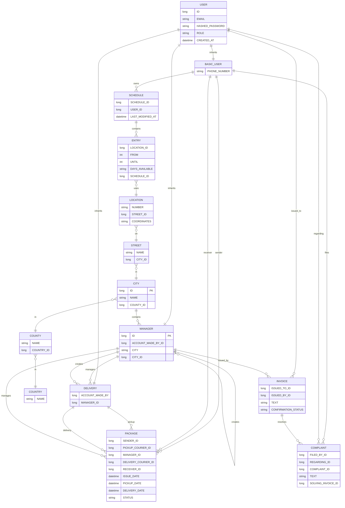

# DynamicDeliverySystem
## Hiii 👋 - this is a work in progress project! I'm glad that you decided to visit it!

It's meant to be a system that supports a delivery service where the user can define their schedule and have the parcel be delivered at their actual location. 📦🗓️🧭📍🔄 

### Ever had to leave work early just to catch a parcel that's supposed to arrive at your home?

Basically, for each day of the week, the user can **define the time periods and the locations** where they're found at.

Using this schedule (*without needing to know ahead of time*), the courier can now do their job, at the **right place and at the right time ** - not just "Leave it at the entrance" or "It's been placed in an easybox where you can pick it up".

## Roadmap : 
  - [x] Define the use-cases 
  - [x] Determine the general architecture of the project
  - [x] Design the classes this system relies upon, in a class diagram 
  - [ ] Translate the class diagram into a back-end implementation
  - [x] Provide a user-friendly front-end web interface
  - [x] Have said implementation talk to an nginx reverse proxy
  - [x] Tie it all up with a docker-compose.yml file so it builds nicely and not only "Works on my machine"

## Use case diagram

## ER diagram

